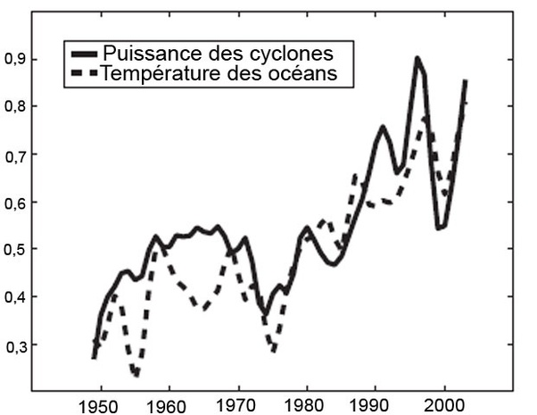
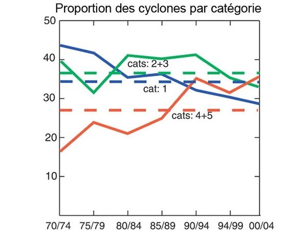

*Réponse publiée [sur Quora](https://fr.quora.com/Quelle-sera-la-premi%C3%A8re-grande-catastrophe-caus%C3%A9e-par-le-r%C3%A9chauffement-climatique/answer/Dr-Goulu)*

Il n'y en aura pas. On est comme la grenouille dans l'eau qui chauffe : par rapport aux années précédentes, les changements sont faibles, donc on se dit "ouais, c'est une catastrophe, mais il y en a eu avant et rien ne prouve que celle-ci soit causée par le réchauffement, attendons de voir …"

Un exemple typique est l'[Élévation du niveau de la mer](w:). 3.5 mm par an, c'est pas une catastrophe. quelques îles du Pacifique devront être évacuées [4], mais il y a d'autres endroits où aller en vacances … L'eau salée qui imprègne les sols rend quelques milliers d'hectares impropres à l'agriculture, mais on déforeste ailleurs, donc on ne meurt pas encore de faim. Quand des millions d'agriculteurs devront quitter le delta du Gange au Bangladesh ou celui du Nil en Egypte, ça sera un problème d'immigration ou une guerre locale, pas une catastrophe due au réchauffement climatique ….

Sur les phénomènes météorologiques, pour l'instant on a pas encore suffisamment de recul pour faire des statistiques fiables, mais il commence à y avoir de sérieux indices que les cyclones deviennent plus violents. Pas plus fréquents, mais plus fréquemment violents. Selon [Climat : les cyclones vont-ils s'intensifier ?](https://www.cite-sciences.fr/archives/science-actualites/home/webhost.cite-sciences.fr/fr/science-actualites/enquete-as/wl/1248100289305/climat-les-cyclones-vont-ils-s-intensifier/index.html)

> Pour la première fois, deux études, parues en 2005, démontrent que le nombre de cyclones reste stable mais que leur puissance globale augmente depuis un demi siècle.
>
>
>
> La première étude, publiée le 4 août 2005 dans Nature [1], montre que l'énergie totale dissipée par les cyclones de l'Atlantique Nord et du Pacifique Ouest a plus que doublé depuis 1950. L'auteur, Kerry Emanuel de l'Institut de technologie du Massachusetts, s'est basé sur les enregistrements des vitesses maximales des vents durant tout le cycle de vie des cyclones pour estimer leur quantité d'énergie libérée, et donc leur puissance. Par ailleurs, ce météorologue américain a également comparé l'évolution de la puissance des cyclones avec celle de la température de la surface des océans. Résultat : les courbes évoluent de façon très similaire.

> La proportion des cyclones de catégorie 4 et 5 a pratiquement doublé en trente ans.
>
>
>
> La seconde étude a été publiée dans Science le 16 septembre 2005 [2]. Cette fois, l'équipe de Peter Webster de l'Institut de technologie de Georgia, a calculé grâce aux archives satellites disponibles depuis 1970 le nombre de tempêtes (vitesse des vents < 118 Km/h) et de cyclones (vitesse des vents > 118 Km/h), la durée de ces évènements climatiques et leur intensité. Les résultats indiquent que le nombre total de cyclones reste stable.

> En revanche, le nombre de cyclones de catégorie 4 ou 5 a augmenté de 57 % entre 1970 et 2004. En proportion, les cyclones de force majeure sont ainsi passés de 20 % à 35% en 30 ans. Seul aspect positif : la puissance maximale des cyclones est relativement stable depuis 35 ans.

Et puis les sécheresses sont de plus en plus fréquentes en Europe , conformément aux modèles du GIEC, et l'article [3] montre que ces sécheresses sont atypiques sur els dernier 2000 ans.

Mais ce n'est pas un catastrophe : on peut importer de la bouffe, désaliniser de l'eau, ou juste espérer que ça ira mieux l'année prochaine, n'est-ce pas [Jacques-Marie Moranne](https://fr.quora.com/profile/Jacques-Marie-Moranne) ?

**Références :**

1. Emanuel, K. (2005). [Increasing destructiveness of tropical cyclones over the past 30 years](https://doi.org/10.1038/nature03906), *Nature 2005 436:7051*, *436*(7051), 686–688. ([pdf](https://texmex.mit.edu/pub/emanuel/PAPERS/NATURE03906.pdf))
2. Webster, P. J., Holland, G. J., Curry, J. A., & Chang, H. R. (2005). Changes in Tropical Cyclone Number, Duration, and Intensity in a Warming Environment. *Science*, *309*(5742), 1844–1846. [https://doi.org/10.1126/SCIENCE....](https://doi.org/10.1126/SCIENCE.1116448) ([pdf](https://webster.eas.gatech.edu/Papers/Webster2005b.pdf) )
3. Freund, M. B., Helle, G., Balting, D. F., Ballis, N., Schleser, G. H., & Cubasch, U. (2023). [European tree-ring isotopes indicate unusual recent hydroclimate](https://doi.org/10.1038/s43247-022-00648-7). *Communications Earth & Environment 2023 4:1*, *4*(1), 1–8. ( [pdf](https://www.nature.com/articles/s43247-022-00648-7.pdf) )
4. (ajoutée suite à l'échange avec JMM dans les commentaires) Albert, S., Leon, J. X., Grinham, A. R., Church, J. A., Gibbes, B. R., & Woodroffe, C. D. (2016). [Interactions between sea-level rise and wave exposure on reef island dynamics in the Solomon Islands](https://doi.org/10.1088/1748-9326/11/5/054011) . *Environmental Research Letters*, *11*(5), 054011.
