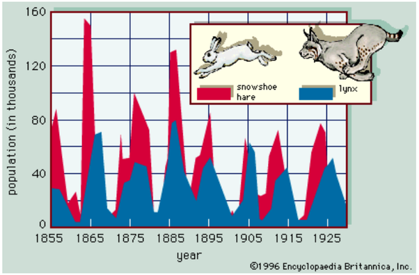

*Réponse publiée [sur Quora](https://fr.quora.com/L-Humanit%C3%A9-va-t-elle-dispara%C3%AEtre-par-sa-surpopulation-Faut-il-que-la-moiti%C3%A9-des-humains-disparaissent/answer/Dr-Goulu)*

Une espèce disparait quand elle a 0 individus, pas 10 milliards … La surpopulation c'est juste le contraire de l'extinction, et la disparition (ou la non-naissance…) de la moitié des humains ne changerait pratiquement rien.

Juste comme sujet de réflexion, voici un graphique célèbre :

Ce sont des données récoltées par la compagnie de la Baie d’Hudson au Canada, une société collectant les fourrures des animaux chassés par les trappeurs à la fin du 19ème + début du 20ème siècle. On représente le nombre de fourrures de lapins et de lynx récoltés. Si on suppose que le nombre d’animaux attrapés est proportionnel à l’effectif total de la population alors ce graphe rend compte des variations des populations de lynx et de lapins.

Vous voyez que les populations de lynx et de lapins oscillent d'un facteur DIX en 10 ans seulement !

Dans la nature, il arrive fréquemment que des populations soient carrément décimées, et repartent de quelques centaines d'individus. Des espèces qui étaient en voie d'extinction se repeuplent dès qu'on arrête de les chasser…

"N'ayez pas peur" : la population humaine sera divisée par 10, 100 ou même 1000 un jour. Après ce réchauffement climatique dramatique il y aura une glaciation, et des guerres mondiales, et des épidémies etc etc, mais la vie reprend (presque) toujours grâce à la reproduction, exponentielle.

Vous avez peur pour vos enfants et petits-enfants ? N'en faites pas. Il n'est pas obligatoire d'avoir des enfants. Je suis froid et cynique ? Peut-être …
