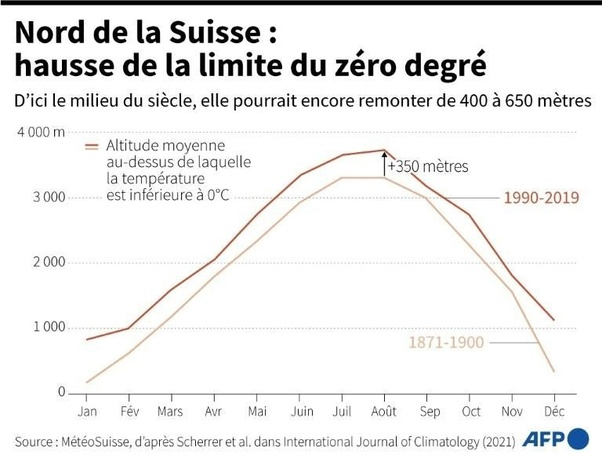

*Réponse publiée [sur Quora](https://fr.quora.com/La-temp%C3%A9rature-au-sommet-du-Mont-Blanc-est-positive-pour-trouver-des-temp%C3%A9ratures-n%C3%A9gatives-il-faut-monter-%C3%A0-5100-m%C3%A8tres-est-ce-le-changement-climatique/answer/Dr-Goulu)*

Un événement local "record" ne peut pas être attribué au réchauffement climatique.

Mais sa répétition de plus en plus fréquente en raison d'une moyenne des températures qui augmente est clairement un effet du réchauffement climatique.

Sur le graphique ci-dessous, vous voyez que l'isotherme 0° moyen sur 30 ans s'est élevé de 350m en 80 ans : ça c'est le réchauffement climatique. Un record à 5100m est l'équivalent d'un record à 4750m il y a un siècle

