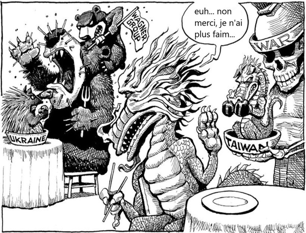

*Réponse publiée [sur Quora](https://fr.quora.com/A-quel-moment-le-monde-lors-de-la-2eme-guerre-mondiale-s-est-alli%C3%A9e-pour-ouvertement-d%C3%A9clarer-la-guerre-%C3%A0-Hitler-et-est-ce-que-cette-situation-pourrait-arriver-face-Poutine/answer/Dr-Goulu)*

Poutine reproduit exactement le schéma d'Hitler avec les [Allemands des Sudètes](w:). Il dit:

> puisque la majorité des gens en Crimée et au Donbass (Sudètes) parlent russe (allemand) , ils sont russes (allemands) et je vais les libérer en envahissant toute l'Ukraine (Tchécoslovaquie).
>
>
>
> Et comme l'Ukraine ne fait pas partie de l'OTAN, les européens vont me faire un papier genre [Accords de Munich](w:)et laisser tomber.

Sauf qu'on a pas oublié qu'un an plus tard Hitler [envahissait la Pologne](w:Campagne_de_Pologne_(1939))après un accord secret avec Staline (Xi Jinping ?) qui elle était alliée à la France et au Royaume-Uni : guerre mondiale.

Les [Alliés de la Seconde Guerre mondiale](w:)se sont formés progressivement par effet domino, mais maintenant l'OTAN est formé, entraîné et prêt : à la première attaque contre un de ses membres la Russie sera "rétamée propre en ordre" comme on dit ici.

La seule inconnue sera ce que fera la Chine dans ce cas.

