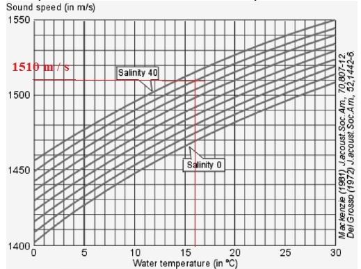

*Réponse publiée [sur Quora](https://fr.quora.com/La-vitesse-des-ultrasons-est-elle-plus-%C3%A9lev%C3%A9e-dans-leau-chaude-ou-dans-leau-froide-Et-pour-quelles-raisons/answer/Dr-Goulu)*

La vitesse des ultrasons est la même que celle du son ou des infrasons.

Elle augmente avec la température (et la salinité)

Selon [Vitesse du son — Wikipédia](w:Vitesse_du_son) la vitesse du son dans un fluide vaut $c=\sqrt{1/\chi.S.\rho}$ où $\rho$ est la densité et $\chi.S$ le coefficient de [compressibilité isentropique](w:).

La densité est maximale vers 4 degrés puis diminue avec la température, ce qui fait augmenter la vitesse du son (il y a moins de molécules d'eau à faire vibrer par unité de longueur)

Pour la compressibilité, je n'ai pas trouvé comment elle varie avec la température.
