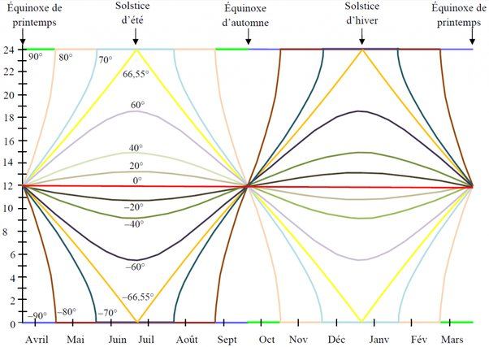

*Réponse publiée [sur Quora](https://fr.quora.com/En-hiver-pendant-combien-de-jours-on-ne-voit-pas-le-soleil-dans-les-pays-scandinaves/answer/Dr-Goulu)*

Vous pouvez le calculer en fonction de la latitude grâce à la formule fournie ici

[https://www.drgoulu.com/2013/08/...](https://www.drgoulu.com/2013/08/11/combien-dure-un-jour/)

C est la "longueur du plat" en bas de ce graphique

À 70 degrés de latitude nord (courbe bleu ciel) vous avez environ 2 mois sans soleil, du 21 novembre au 21 janvier environ.
