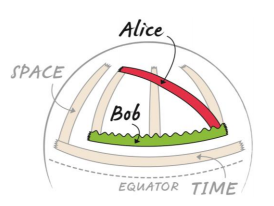

*Réponse publiée [sur Quora](https://fr.quora.com/Je-suppose-que-c-est-impossible-mais-quelqu-un-serai-capable-d-expliquer-de-fa%C3%A7on-assez-simple-ou-d%C3%A9taill%C3%A9-si-vous-le-souhaitez-pourquoi-le-sol-acc%C3%A9l%C3%A8re-vers-le-haut/answer/Dr-Goulu)*

Oui, il y a ça dans ce petit document du CERN emprunté au [Perimeter Institute](https://www.perimeterinstitute.ca/), donc pas n'importe quoi…

Ce document répond en même temps à la question évidente : comment le sol peut-il accélérer vers le haut sans bouger vers le haut ? Je traduis la réponse donnée dans ce document tellement c'est BEAU :

> Regardons un scénario simple: Alice tombe d'une échelle tandis que Bob se tient en bas.
>
>
>
> 
>
>
>
> Si nous esquissons le chemin d'Alice en tombant, nous voyons qu'elle trace une ligne COURBE et Bob trace une ligne DROITE. Cela a du sens pour nous parce que nous croyons en la force de gravité donc Alice devrait accélérer et Bob ne devrait pas bouger.
> En utilisant du ruban adhésif sur une surface plane, nous voyons qu'une ligne courbe sera froissée, et une ligne droite sera lisse, nous utiliserons cela comme définition pour "accélérer" et "ne pas accélérer".
>
>
>
> Selon Einstein, il n'y a AUCUNE FORCE de gravité! Alice devrait tracer une ligne droite tandis que Bob devrait tracer une ligne courbe parce que c'est lui qui accélère. Nous avons besoin d'un moyen pour qu'Alice trace une ligne DROITE alors qu'elle tombe du haut de l'échelle en bas, et pour que Bob trace une ligne COURBE alors qu'il se tient au bas de l'échelle.
>
>
>
> La solution: dessinez l'image sur une surface courbe!
>
>
>
> 
>
>
>
> La bande qui représente Alice est maintenant lisse donc DROITE, et la bande qui représente Bob est froissée (c'est-à-dire COURBE ). Nous avons réussi à montrer comment Alice peut tomber sans accélérer et Bob peut accélérer sans bouger! Tout ce que nous devons faire c'est changer la GEOMETRIE de l'espace-temps - la gravité n'est pas une force, c'est une courbure de l'espace-temps!
>
>
>
> Et regardez le haut des échelles sur votre ballon de plage. Que se passe-t-il si Alice reste sur l'échelle? Elle tracera un chemin plus court dans le temps que Bob. Or la relativité prédit que la gravité déforme le temps ! Cette prédiction est vérifiée chaque jour dans le système GPS.
