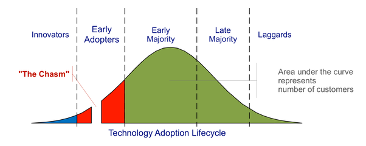

*Réponse publiée [sur Quora](https://fr.quora.com/Comment-peut-on-imaginer-la-faillite-des-entreprises-en-avance-sur-leur-temps-que-le-monde-n%C3%A9tait-pas-pr%C3%AAt-pour-elles/answer/Dr-Goulu)*

Si le monde n'est pas prêt pour elles, elles ne peuvent même pas naître.

Le problème des entreprises "en avance sur leur temps" c'est de [Franchir le gouffre](https://deslivrespoursenrichir.fr/crossing-the-chasm/)du cycle de vie d'un produit

Vos premiers clients sont les "innovateurs" qui achètent tout ce qui est nouveau, même si ça ne marche pas très bien.

Ensuite les "adoptants précoces" aiment ce qui est nouveau, mais il faut que ça marche.

Ensuite il faut un certain temps pour que votre produit fasse ses preuves et soit connu de la majorité. Et pendant ce temps, vous avez un gros trou dans vos ventes. Si votre business plan prévoyait une croissance régulière des ventes, vous êtes mort.
