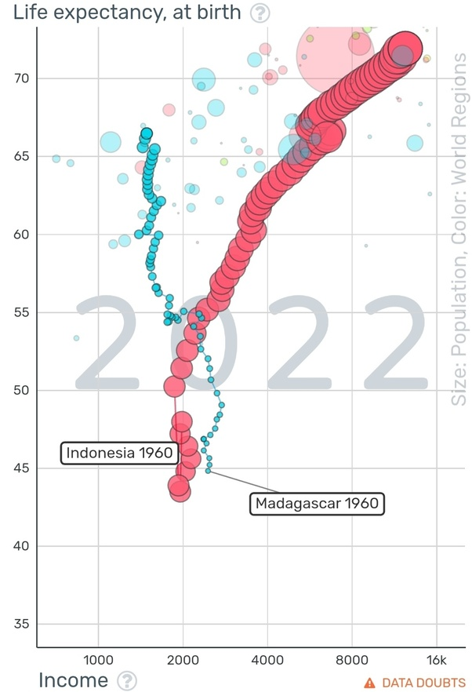

*Réponse publiée [sur Quora](https://fr.quora.com/Pourquoi-tu-naccepte-pas-Madagascar-est-une-pays-riche/answer/Dr-Goulu)*

Malheureusement, Madagascar est un des pires pays en matière de développement.

En plus de 60 ans depuis l'indépendance, le revenu par habitant a régressé. C'est le seul pays du monde à ma connaissance, peut être avec Haïti, qui n'ait pas réussi à améliorer la situation économique de ses habitants sur une si longue période.

La seule "consolation" est que les malgaches ont aujourd'hui une espérance de vie de 67 ans, contre 45 en 1960

Si on compare à l'Indonésie qui était dans une situation similaire en 1960, les indonésiens vivent aujourd'hui 72 ans avec un revenu 4.5 fois plus élevé qu'en 1960.

[https://www.gapminder.org/tools/...](https://www.gapminder.org/tools/#$model$markers$bubble$encoding$y$scale$zoomed@:40.4&:74.08;;;&x$scale$zoomed@:1013.66&:15933.85;;;&frame$value=2022;&trail$data$filter$markers$mdg=1960;;;;;;;;&chart-type=bubbles&url=v1)
