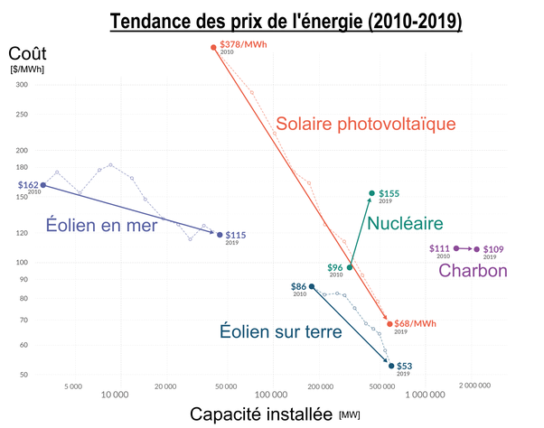

*Réponse publiée [sur Quora](https://fr.quora.com/Iter-suffira-t-il-%C3%A0-produire-toute-l%C3%A9nergie-n%C3%A9cessaire-au-monde-de-dix-milliards-dindividus-qui-se-profile-devant-nous/answer/Dr-Goulu)*

Non. Il ne faut absolument pas compter sur la fusion contrôlée pour nous sortir du caca.

La fusion contrôlée est beaucoup plus difficile à réaliser que ce qu'on pensait, sinon ça fait des décennies qu'elle produirait.

[https://www.drgoulu.com/2005/12/...](https://www.drgoulu.com/2005/12/11/la-fusion-thermonucleaire/)

Si ça marche un jour, on a actuellement aucune idée du prix du kWh qui sera ainsi produit.

Pendant ce temps, le prix du kWh de fusion naturelle captée sur Terre n'arrête pas de diminuer d'un facteur presque 10 en 10 ans actuellement

[Énergie solaire photovoltaïque — Wikipédia](w:Énergie_solaire_photovoltaïque)
