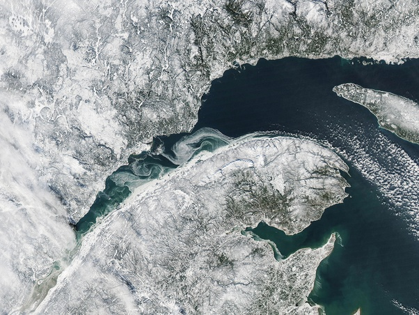

*Réponse publiée [sur Quora](https://fr.quora.com/Pourquoi-sur-toutes-les-photos-de-la-plan%C3%A8te-prises-de-l-espace-la-terre-semble-vierge-et-inhabit%C3%A9e/answer/Dr-Goulu)*

Parce que vous ne regardez pas assez bien.

D'autres vous ont montré des images de nuit, je vous montre celle-ci de la baie du Saint Laurent au Québec l'hiver

En zoomant vous verrez les routes sur les rives, et en regardant encore mieux dans la forêt, vous verrez des saignées pour le passage de lignes à haute tension.

[https://drgoulu.com/2010/03/19/0...](https://drgoulu.com/2010/03/19/0-01-ohmkm/)
