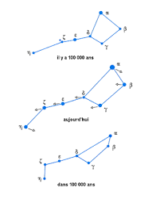

*Réponse publiée [sur Quora](https://fr.quora.com/Comment-les-etoiles-ont-pu-se-d%C3%A9placer-pr%C3%A9cis%C3%A9ment-pour-dessiner-les-constellations-astrologiques/answer/Dr-Goulu)*

La patate, la cafetière et le caniche ?

Les [Constellations](w:Constellation)sont des constructions culturelles, les chinois ou les polynésiens en ont de tout à fait différentes car du point de vue astronomique rien ne relie les étoiles brillantes du ciel. Elles ne sont même pas approximativement à la même distance et elles bougent assez vite. Par exemple la Grande Ourse est en train de se transformer en Poêle à Frire.

Dites vous que le Soleil est une petite étoile de rien du tout, semblable à des milliers d'autres, faisant partie de la constellation du Zburgl vue d'une d'entre elles, et de la constellation du Vralogh depuis une autre.
