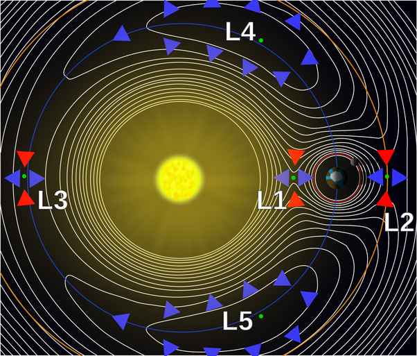

*Réponse publiée [sur Quora](https://fr.quora.com/Comment-une-sonde-spatiale-peut-elle-%C3%AAtre-stabilis%C3%A9e-a-un-point-de-Lagrange-tourne-t-elle-autour/answer/Dr-Goulu)*

Il faut commencer par comprendre cette figure qui illustre l'article [Point de Lagrange — Wikipédia](w:Point_de_Lagrange) :

Elle représente le potentiel gravitationnel autour d'un système de 2 corps, disons le Soleil et la Terre, et les positions des 5 points de Lagrange correspondants

On voit que L1, L2 et L3 sont stables dans la direction de leur orbite autour du Soleil. Si votre sonde est légèrement déplacée sur cette orbite, elle reviendra vers le point de Lagrange correspondant (flèches rouges)

Par contre si la sonde s'écarte dans la direction perpendiculaire, aucune force ne la ramènera, au contraire elle tendra à s'en écarter (flèches bleues). L1, L2 et L3 sont donc des "cols" sur la surface de potentiel gravitationnel.

L4 et L5 sont instables dans les deux directions, mais sont situés sur un plateau du potentiel : la sonde s'en écartera très lentement.

Reste la direction perpendiculaire au plan du dessin : là tout objet sera ramené dans le plan, partout, y compris aux 5 points de Lagrange.

Donc en L4 et L5, la sonde peut osciller perpendiculairement au dessin, mais il faut utiliser un peu ses moteurs de temps en temps pour la ramener "horizontalement " vers le point.

Au points L1, L2 ou L3, la sonde peut orbiter toute seule dans un plan perpendiculaire au dessin tangent à l'orbite autour du Soleil, mais il faut utiliser les moteurs pour que la sonde ne quitte pas ce plan.

Ceci est le cas du téléscope spatial James Web en L2, dont l'orbite est calculée pour que ses panneaux solaires soient alimentés, mais que son bouclier thermique le protège aussi du rayonnement terrestre

[https://youtu.be/6cUe4oMk69E?si=...](https://youtu.be/6cUe4oMk69E?si=lCjLp9aKE6OwCHB2)

Ajout suite à commentaire de [Yodus Dumbleda](https://fr.quora.com/profile/Yodus-Dumbleda) : en fait L4 et L5 sont stables parce que tout ça tourne !

> de façon plus surprenante, un point de Lagrange peut être stable s'il correspond à un maximum local du potentiel, c'est-à-dire que Ω,xx + Ω,yy peut être négatif, pourvu que cette quantité ne dépasse pas la valeur critique de -4 ω2. En pratique, c'est ce qui se produit dans certains cas pour les points de Lagrange L4 et L5.
>
>
>
> L'interprétation physique de cette situation est que la stabilité est alors assurée par la force de Coriolis. Un objet légèrement décalé d'un tel point va s'en éloigner dans un premier temps en façon radiale, avant de voir sa trajectoire incurvée par la force de Coriolis. Si le potentiel est partout décroissant autour du point, alors il est possible que la force de Coriolis force l'objet à tourner autour du point de Lagrange.
>
>
>
> ([Point de Lagrange — Wikipédia](w:Point_de_Lagrange))
