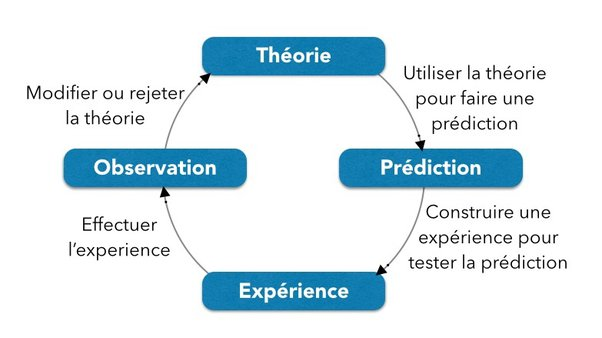

*Réponse publiée [sur Quora](https://fr.quora.com/La-Vision-scientifique-est-elle-d%C3%A9nu%C3%A9e-de-croyances-Dit-autrement-le-domaine-de-la-science-est-il-neutre-Ou-ses-adh%C3%A9rants-poss%C3%A8dent-ils-des-croyances-mat%C3%A9rialistes/answer/Dr-Goulu)*

Il n'y a pas de "vision scientifique" encore moins avec un V majuscule. Il y a une [méthode scientifique](w:), c'est très différent.

Elle est toute simple

C'est un cycle d'amélioration continue, très similaire à la [roue de Deming (PDCA)](w:Roue_de_Deming).

Il n'y a aucune croyance là dedans, ni référence explicite au matérialisme. La méthode permet de remettre absolument tout en question dès lors qu'on a une expérience ou observation qui le permet, et ceci a été le cas à de nombreuses reprises dans l'histoire des sciences.

Et le résultat est là : 8 milliards de gens ne meurent pratiquement plus de famines ou de maladies infectieuses parce que la science leur fournit des engrais, des machines et des médicaments qui se révèlent statistiquement plus efficaces que les prières.

Le matérialisme est une conséquence assez logique de l'efficacité de la méthode scientifique par rapport aux croyances, qui n'ont aucun mécanisme d'amélioration continue.

La science, c'est ce qui marche même si on y croit pas.
