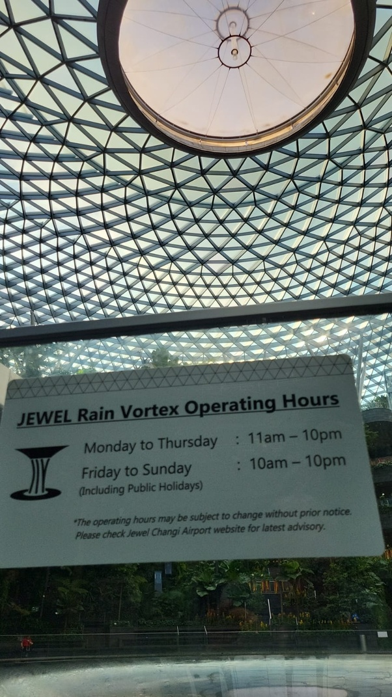
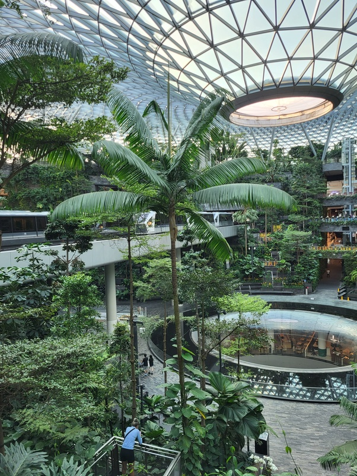

*Réponse publiée [sur Quora](https://fr.quora.com/Comment-est-le-Jewel-%C3%A0-Singapour/answer/Dr-Goulu)*

Décevant. J'y étais il y a une semaine pour prendre l'avion du retour, mais à 9h du matin c'est quasi désert, la cascade ne fonctionne qu'à partir de 11h.

Ma photo triste :

Sérieusement, même sans la cascade le site est étonnant

Mais pas autant que les Singapore Gardens, et notamment les deux extraordinaires serres jardins botaniques.

Bref, si vous êtes à l'aéroport aux bonnes heures, passez voir le Jewel, mais sinon ne venez pas exprès depuis la ville, allez aux Gardens. Tôt le matin pour éviter la foule.
