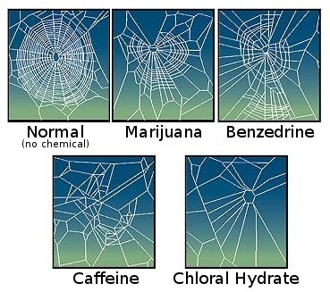

*Réponse publiée [sur Quora](https://fr.quora.com/Les-insectes-peuvent-ils-%C3%AAtre-drogu%C3%A9s/answer/Dr-Goulu)*

Oh oui bien sur. A quelque chose près ils ont les mêmes neurones et la même chimie du cerveau que nous.

Une des plus célèbres expériences sur le sujet et de regarder les toiles d'araignée produites sous l'effet de diverses substances :

Source : Noever, R., J. Cronise, and R. A. Relwani. 1995. Using spider-web patterns to determine toxicity. NASA Tech Briefs 19(4):82. Published in New Scientist magazine, 29 April 1995. via [Effets des substances psychoactives sur les animaux — Wikipédia](w:Effets_des_substances_psychoactives_sur_les_animaux)

Remarquez que les araignées sont très sensibles à la caféine, ce qui est très normal car la plupart des drogues d'origine végétales sont produites par les plantes justement "pour" se défendre contre les insectes.

(oui je sais, les araignées ne sont pas des insectes…)
