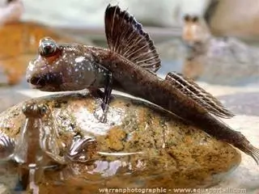
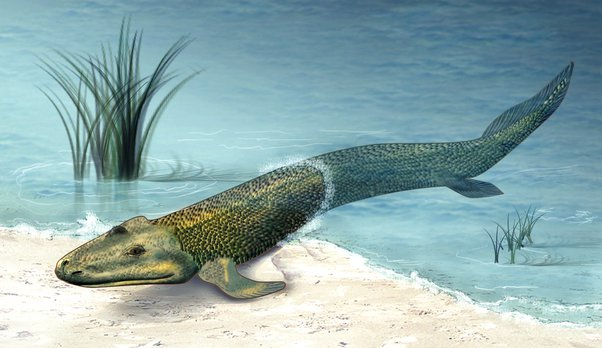

*Réponse publiée [sur Quora](https://fr.quora.com/Si-lhomme-vient-dun-poisson-celui-ci-%C3%A9tait-il-mal-ou-femele-Quelle-%C3%A9tait-la-couleur-de-ce-poisson/answer/Dr-Goulu)*

Tous les espèces animales terrestres dont les humains descendent d'une ou plusieurs espèces d'animaux marins [sortis des eaux](w:Sortie_des_eaux)il y a 430 millions d'années environ.

Depuis, de nombreux animaux ont fait le trajet inverse (baleines, dauphins) ou sont en train de le faire (manchots, phoques, lamantins, ou même hippopotames), et d'autres animaux marins continuent à s'adapter à la Terre. L'évolution n'arrête jamais.

Il y a notamment plusieurs espèces d'[Oxudercinae](w:)que vous pouvez facilement observer dans des mangroves

Nos plus anciens ancêtres respirant de l'air ressemblaient peut être à [Tiktaalik](w:), le plus vieux fossile de "poisson à pattes" datant de 375 millions d'années:

Pour la couleur, bof…c'est important ? Il avait la couleur qui lui donnait la meilleur chance de survie. La couleur des êtres vivants change très vite.

La [Phalène du bouleau](w:), qui se pose sur le tronc clair des bouleaux, est devenue noire en 100 ans quand la pollution au charbon a rendu les troncs noirs…
