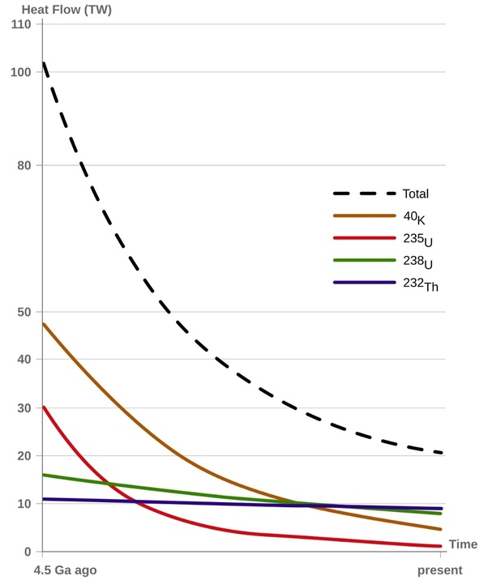

*Réponse publiée [sur Quora](https://fr.quora.com/Soi-disant-que-notre-magma-se-maintient-chaud-par-radio-activit%C3%A9-naturelle-%C3%A7a-me-semble-assez-comique-Ne-serait-ce-pas-plut%C3%B4t-gr%C3%A2ce-aux-intrants-de-vent-solaire-aux-p%C3%B4les-ou-frottements/answer/Dr-Goulu)*

Hypothèse intéressante, voyons…

- " intrants de vent solaire aux pôles", donc il devrait faire plus chaud aux pôles, y avoir plus de volcans etc. Ça me semble pas être le cas.
- "frottements dus à rotation". Frottements avec quoi ? Et ça devrait ralentir la rotation de la Terre.

Dans les deux cas on devrait avoir une surface plus chaude qu'en profondeur, non ? Ce n'est pas ce que les forages montrent…

Mais effectivement la rotation de la Terre ralentit. Le [Réchauffement par effet de marée](w:) de la Terre calculable "facilement" à partir de ce ralentissement a une puissance de 3.3 TW.

C'est bien mais il manque environ 20 TW pour atteindre les 24 TW du [Bilan radiatif de la Terre](w:), et il se trouve que c'est à peu près ce que donne la désintégration des 4 isotopes radioactifs dont on peut mesurer l'évolution au cours du temps par les "déchets" qu'ils ont laissé dans les couches géologiques[[1]](#IKbnf) .

Donc voilà, la réalité est peut-être "comique" pour vous, mais jusqu'à ce que vous trouviez 20 TW qui chauffent de l'intérieur et comment les isotopes radioactifs présents ne chauffent pas, elle est comme ça.

[https://drgoulu.com/2013/11/03/l...](https://drgoulu.com/2013/11/03/la-radioactivite-naturelle/)

Notes de bas de page

[[1]](#cite-IKbnf)[https://www.sciencedirect.com/sc...](https://www.sciencedirect.com/science/article/abs/pii/S0012821X08007711)
