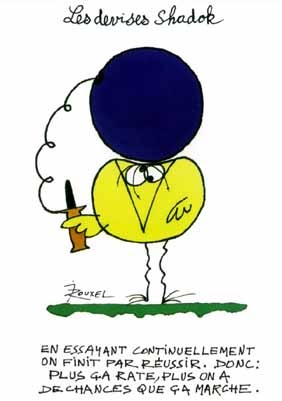

*Réponse publiée [sur Quora](https://fr.quora.com/La-philosophie-peut-elle-apporter-des-r%C3%A9ponses-d%C3%A9finitives-aux-grandes-questions-de-lexistence/answer/Dr-Goulu)*

Absolument.

Par exemple :

1. L'existence précède l'essence.
2. L'essence précède l'existence.

Voilà deux réponses à une grande question de l'existence, dont l'une est définitive*.

Laquelle ? Aucune idée, et aucun moyen de le savoir. Pourtant les deux ponts de vue ont été proposés et sont encore débattus par des philosophes aussi sérieux les uns que les autres.

Et c'est comme ça pour toutes les grandes questions de l'existence : pour chaque réponse bien profonde recto, vous trouverez une profonde réponse verso qui soutient exactement le contraire.

Mais à force de déblatérer sur tous les sujets imaginables, parfois les philosophes tombent juste, par pur hasard.

L'arbitre, c'est la science. Dès qu'on est capables de faire des expériences, le croupier dit "rien ne va plus" et un numéro sort gagnant :

- Les étoiles sont des soleils, Giordano Bruno, cramé en 1600 par d'autres philosophes pour cette déconnade, avait raison
- Empedocle, Epicure, Démocrite et Lucrèce avaient raison : les espèces évoluent. Un mauvais point pour Aristote le fixiste…
- Et 4 mauvais points de plus à Aristote pour son idiotie des 4 éléments (eau, terre, feu, air) qui a fourvoyé les alchimistes pendant des siècles alors que Leucite et Démocrite (wow ! deux coups de bol ! ) étaient tombés juste avec l'atomisme
- Etc etc etc
- Et aujourd'hui on doit en être à 100'000 à zéro expériences scientifiques pour le matérialisme face au spiritualisme, mais il y a toujours des spiritualistes…

La philosophie est un "brain storming" ou chacun peut proposer sa réponse définitive aux "grandes questions de l'existence" sans avoir à démontrer ou à prouver quoi que ce soit. Il faut juste que ça sonne bien intello avec des mots comme "existence" ou "essence".

Plus beau encore, on a même pas besoin que ces mots aient une définition univoque claire pour tout le monde, ou même qu'ils correspondent à quelque chose de réel. Et au besoin on peut même inventer des mots comme aporie, contingence, conatus ou ontologie pour que ça en chie encore un peu plus.

Bref, si vous ne trouvez pas la réponse à votre grande question de l'existence, devenez philosophe et déconnez le contraire d'une autre réponse à une grande question de l'existence.

> L'intelligence c'est pas sorcier, il suffit de penser à une connerie et de dire l'inverse.
>
>
>
> (Michel Colucci, philosophe de la fin du XXème siècle)

Note * : en admettant le principe du tiers exclu, évident jusqu'à ce que Gödel commence à le réduire en cendres…
