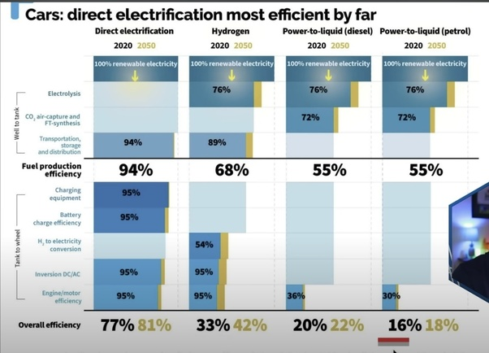

*Réponse publiée [sur Quora](https://fr.quora.com/Quelles-sont-les-alternatives-les-plus-efficaces-aux-v%C3%A9hicules-%C3%A9lectriques-%C3%A0-batteries/answer/Dr-Goulu)*

Aucune. Du point de vue du rendement énergétique, rien n'arrive à la cheville de la voiture électrique à batterie

[https://www.nextbigfuture.com/20...](https://www.nextbigfuture.com/2022/12/electric-cars-are-far-more-efficient-than-hydrogen.html)

Le rendement de la source d'énergie aux roues est le DOUBLE de celui d'un véhicule à hydrogène propre. C'est évidemment mieux avec de l'hydrogène extrait de combustibles fossiles. Ça s'appelle du Green washing.
