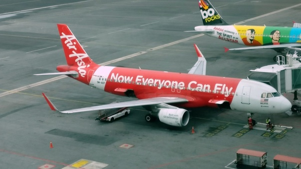

*Réponse publiée [sur Quora](https://fr.quora.com/Comment-justifier-laviation-civil-de-tourisme-aujourdhui-connaissant-la-pollution-de-dingue/answer/Dr-Goulu)*

Bof. L'aviation produit 2.5% des émissions mondiales de CO2[[1]](#trtvh). La déforestation 11%[[2]](#JvyyK), pour comparer.

Ça me paraît plus "dingue" de faire cramer des forêts pour planter de l'huile de palme pour faire rouler des voitures aux biocarburanta…

Et pour justifier l'aviation civile, je dirais que

1. Elle n'a pas besoin d'infrastructure au sol à part les aéroports. Dans la comparaison avec le rail ou la route, je n'ai jamais vu de calcul intégrant la construction et l'entretien des voies / routes
2. Il n'y a malheureusement pas vraiment d'alternative au kerosene pour les avions. Techniquememt on saurait faire des [Avions à propulsion nucléaire](w:Avion_à_propulsion_nucléaire)mais je suis sur que vous y trouveriez aussi des inconvénients…
3. L'aviation a fait des progrès énormes dans la réduction de la consommation des avions, et les poursuit. Aujourd'hui un avion ne consomme plus que 3 litres aux 100 km par passager. Et vole en ligne droite, lui.
4. C'est justement cette réduction spectaculaire de la consommation qui a permis la baisse des prix, et donc une augmentation toute aussi spectaculaire du nombre de vols, splendide illustration du [Postulat de Khazzoom-Brookes](w:): l'augmentation de l'efficacité énergétique cause une augmentation de la consommation d'énergie ! À méditer..
5. Donc vous avez raison : pour réduire les émissions de l'aviation, il faut rendre les vols inabordables pour la classe moyenne, comme dans les années 1960. Il n'y aura plus que les millionnaires qui pourront aller aux Maldives ou à Tahiti.
6. Reste à convaincre le milliard de personnes qui peuvent enfin se payer des vacances de ne pas le faire…

Notes de bas de page

[[1]](#cite-trtvh)[https://fr.wikipedia.org/wiki/Im...](w:Impact_climatique_du_transport_aérien)

[[2]](#cite-JvyyK)[Deforestation and climate change - Wikipedia](w:en:Deforestation_and_climate_change)
