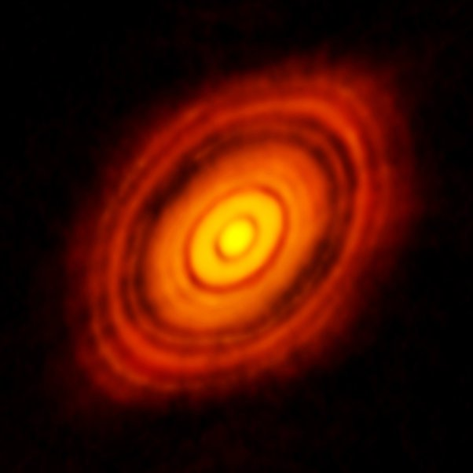

*Réponse publiée [sur Quora](https://fr.quora.com/Savez-vous-pourquoi-la-terre-tourne-on-conna%C3%AEt-les-cons%C3%A9quences-mais-que-savons-nous-de-la-cause/answer/Dr-Goulu)*

C'est le même truc que celui qui fait tourner la patineuse de plus en plus vite quand elle ramène ses bras et jambe près de son corps : la [Conservation du moment cinétique](w:).

Pour la [Formation du Système solaire](w:Formation_et_évolution_du_Système_solaire), c'est la gravitation qui ramène la matière dans un disque qui tourne autour de l'étoile, et qui "coagule" en planètes qui tournent sur elles mêmes.

On a les idées assez claires à ce sujet car on observe des systèmes stellaires en cours de formation, notamment [HL Tauri](w:) :

C'est y pas MAGNIFIQUE ?
