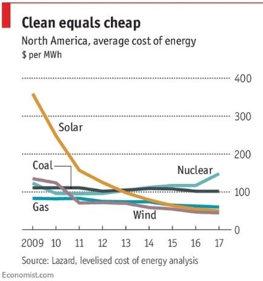

*Réponse publiée [sur Quora](https://fr.quora.com/Les-%C3%A9oliennes-ces-monstres-moches-elles-tuent-les-oiseaux-ab%C3%AEment-nos-paysages-et-co%C3%BBtent-une-fortune-O%C3%B9-est-le-bon-sens/answer/Dr-Goulu)*

Le bon sens c'est de mettre les nuisances près de l'endroit où on en tire les bénéfices.

C'est vrai que c'était mieux quand c'était les paysages et la faune des autres qui souffraient de votre consommation d'énergie…

Quand au prix, aujourd’hui le kWh solaire et éolien produit est moins cher que le nucléaire et même le charbon

Venez voir dans le Nordeste brésilien, ici ils font des parcs de 100 éoliennes de 5MW chacune avec des facteurs de charge de l'ordre de 50%

[Énergie éolienne au Brésil — Wikipédia](w:Énergie_éolienne_au_Brésil)
