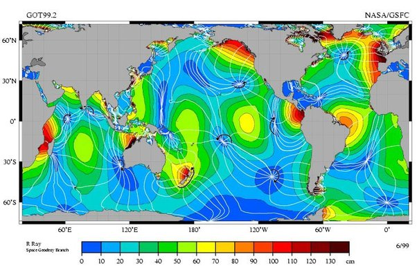
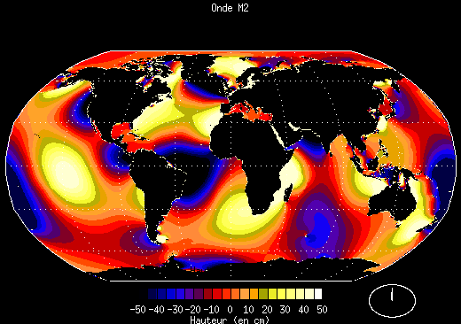

*Réponse publiée [sur Quora](https://fr.quora.com/Les-mar%C3%A9es-haute-et-basse-sont-elles-simultan%C3%A9es-des-deux-c%C3%B4t%C3%A9s-d-un-oc%C3%A9an/answer/Dr-Goulu)*

Non, c'est beaucoup plus compliqué parce que les marées sont une réponse dynamique à des excitations périodiques, et ces réponses dépendent notamment de la forme du bassin.

Ce que vous cherchez ce sont les [Lignes cotidales](w:Ligne_cotidale). La pleine mer (="marée haute") se produit au même moment sur les lignes blanches de la figure ci-dessous :

Les marées n'oscillent pas d'est en ouest, elles tournent autour des [Points amphidromiques](w:Point_amphidromique) où il n'y a quasiment pas de marée.

En animation, ça donne ça :

[Combien de marée - Pourquoi Comment Combien](https://drgoulu.com/2017/08/15/combien-de-maree)
