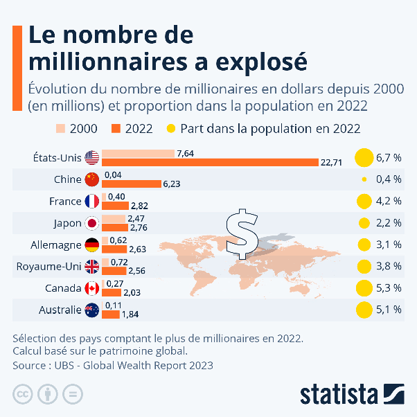
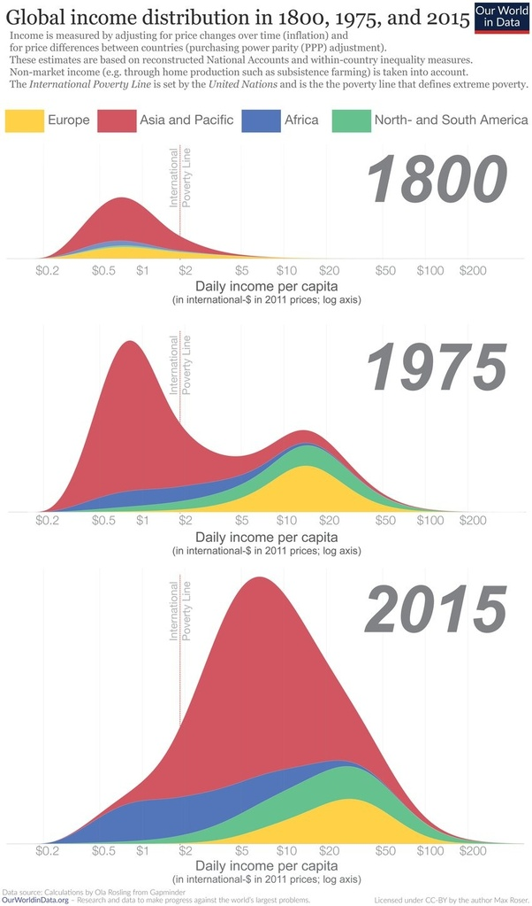

*Réponse publiée [sur Quora](https://fr.quora.com/Les-tr%C3%A8s-riches-sont-de-plus-en-plus-riches-mais-de-moins-en-moins-nombreux-Vers-quel-%C3%A9quilibre-allons-nous-qui-ne-sera-plus-celui-de-Pareto-et-en-fonction-de-quelle-variable-pr%C3%A9cise/answer/Dr-Goulu)*

De moins en moins nombreux ?

Il y avait 470 milliardaires en 2000, il y en a 2700 en 2023[[1]](#TYKbf)!

Pour les millionnaires, la croissance est tout aussi spectaculaire :

> En 2000, on dénombrait 14,7 millions de millionnaires à travers le monde, ce qui - comparé à près de 60 millions aujourd'hui - représente une multiplication par quatre en vingt ans (hausse de 300%).
>
>
>
> (source [Infographie: Combien y a-t-il de millionnaires dans le monde ?](https://fr.statista.com/infographie/amp/25201/pays-avec-le-plus-grand-nombre-de-millionnaires-en-dollars/) Sur Statista)

De plus :

> Le nombre d'individus en dessous du seuil de pauvreté mondial - de nos jours à 2,15 dollars par jour - a reculé moins vite. On comptait 1,7 milliards d'individus extrêmement pauvres au début du siècle, contre près de 700 millions aujourd'hui, soit une baisse d'environ 60 %.

Il faut se rendre à l'évidence : au niveau mondial, les inégalités DIMINUENT !

Et si, justement, on revient progressivement à un équilibre "à la Pareto" après deux siècles où les pays industrialisés ont laissé sur place le "Tiers Monde" qui se rattrape très vite actuellement :

(source et article très intéressant [The history of global economic inequality](https://ourworldindata.org/the-history-of-global-economic-inequality))

La variable précise s'appelle le [Coefficient de Gini](w:).

Notes de bas de page

[[1]](#cite-TYKbf)[Nombre de milliardaires Monde 2000-2023 | Statista](https://fr.statista.com/statistiques/707501/nombre-milliardaires-monde/)
