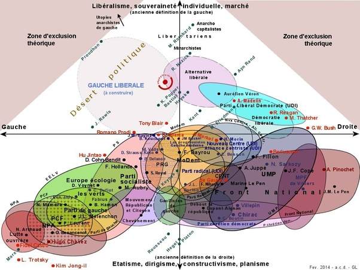
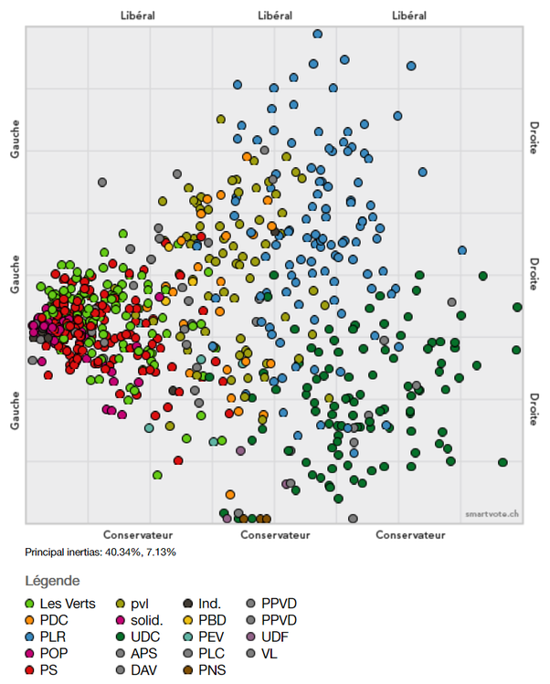

*Réponse publiée [sur Quora](https://fr.quora.com/En-dehors-de-lanarchie-dans-le-monde-combien-y-a-t-il-actuellement-dopinions-politiques-deux-%C3%A0-deux-diff%C3%A9rentes-de-fa%C3%A7on-r%C3%A9ellement-significative/answer/Dr-Goulu)*

Pourquoi "en dehors de l'anarchie"? Et que signifie "réellement significative"?

Il y a un intéressante [Carte 2D du Paysage Politique Français](https://www.gaucheliberale.org/post/2014/02/18/Carte-2D-du-Paysage-Politique-Français-(PPF)-mise-à-jour-février-2014)qui mentionne environ 25 opinions politiques, mais avec recouvrements.

Elle indique le positionnement de quelques politiques étrangers, mais à mon avis de manière arbitraire.

Pour être objectif, il faudrait appliquer au niveau mondial une méthode purement mathématique du type de celle utilisée en Suisse par [smartvote](http://smartvote.ch) et que j'explique un peu ici :

[https://drgoulu.com/2017/05/14/l...](/2017/05/14/la-politique-francaise-dans-la-deuxieme-dimension/)

Mais pour ça il faudrait beaucoup de données, qui sont fournies en Suisse par les nombreux referendums.

Ça permet des produire des cartes telles que celle-ci :

(positionnement de chaque candidat au législatif du canton de Vaud, 2017)

Vous voyez qu'il est difficile de parler d'opinions significativement différentes vu la superposition des positions de candidats de partis différents…
