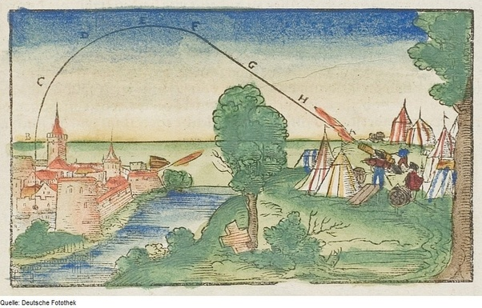

*Réponse publiée [sur Quora](https://fr.quora.com/Est-ce-que-la-physique-du-20-e-si%C3%A8cle-est-contre-intuitive/answer/Dr-Goulu)*

Oui, mais la physique du 19ème aussi, du 18ème aussi, du 17ème aussi etc.

La physique est contre-intuitive. C'est pour ça qu'on a mis des millénaires à découvrir la trajectoire d'un projectile. On a jeté des centaines de lances contre des mammouths puis tiré des centaines de boulets de canon selon cette théorie de [Balistique](w:)de 1547:

L'[Intuition](w:), c'est un raccourci permettant au cerveau d'économiser de l'énergie : pas besoin, ou pas le temps de réfléchir ni de vérifier. Ca marche assez bien quand on rencontre un ennemi, une proie ou un(e) partenaire sexuel(le) , la sélection naturelle s'en est assurée.

Mais pour la physique, l'intuition ne vaut pas tripette. L'Univers n'en a rien a battre d'être simple, ou même compréhensible pour nous. Pratiquement toutes nos intuitions se sont révélées fausses.

Bien sur certains vont dire que certaines découvertes majeures ont été faites par l'intuition de génies. Ouais, mais ces génies réfléchissaient au problème nuit et jour depuis des mois voire des années avant d'avoir leur "intuition". A mon avis c'est plutôt une "fin de tâche en background", du genre de quand vous vous rappelez soudain un truc que vous aviez oublié sur le moment. Le cerveau a bossé en arrière-plan, souvent inconsciemment avant de vous sortir un résultat qui vous éblouit lorsque vous en prenez conscience.

Rien à voir avec l'[Intuition](w:)des philosophes. D'ailleurs comme d'hab ils sont en totale contradiction dès le départ:

> Pour [Platon](w:), l'intuition est la saisie immédiate de la [vérité](w:) de l'[idée](w:) par l'âme indépendamment du corps.
>
>
>
> Au contraire pour [Épicure](w:), l'intuition est la saisie immédiate de la [réalité](w:) du monde par le corps indépendamment de l'âme.

Et en passant, la trajectoire balistique de 1547 ci-dessus était considérée comme une grande amélioration sur celle d'Aristote (le pire philosophe de tous les temps)

> Selon Aristote, il existe deux types de mouvements, le mouvement naturel ramenant les objets vers leurs lieux d'origine, et le mouvement violent, impulsé par un objet à un autre. Ainsi, la pierre tombe car elle revient naturellement à son lieu d'origine, la Terre, alors que le feu s'élève car son lieu d'origine est l'air. D'autre part, tout objet pour être déplacé doit être mû par une action, l'arrêt de l'action entraînant l'arrêt de l'objet. Se pose alors la question d'expliquer pourquoi une pierre lancée en l'air continue son mouvement avant de retomber. Aristote explique cela par le fait que la pierre qui se déplace laisse un vide (ou plutôt une raréfaction de l'air) derrière elle, qui se remplit immédiatement d'air, celui-ci poussant alors la pierre en avant (théorie appelée l'*antiperistasis*)
>
>
>
> ([Impetus — Wikipédia](w:Impetus) )

Ca devrait suffire à interdire totalement à un philosophe de s'exprimer sur la physique…
