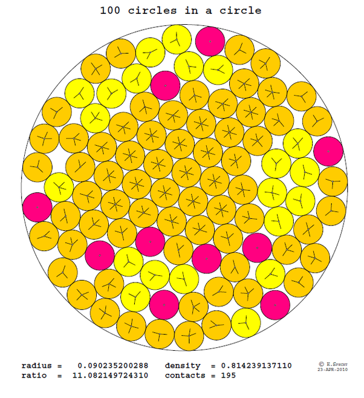

*Réponse publiée [sur Quora](https://fr.quora.com/Peut-on-placer-100-disques-de-rayon-1-sans-qu-ils-se-chevauchent-%C3%A0-l-int%C3%A9rieur-d-un-cercle-de-rayon-11/answer/Dr-Goulu)*

C'est un problème d'[Empilement de cercles dans un cercle](w:)

Malheureusement, [Wikipédia](w:Empilement_de_cercles_dans_un_cercle) ne donne les solutions optimales que jusqu'à n=20 disques

Mais le site de l'Uni de Magdebourg [The best known packings of equal circles in a circle](http://hydra.nat.uni-magdeburg.de/packing/cci/) fourni en référence de l'article Wikipédia donne le meilleur empilement connu de 100 disques:

Le ratio dépasse 11, donc non, ça ne passe pas … Et comme pour N=99 le ratio dépasse aussi 11, la réponse actuelle à votre question est "très probablement non".

Mais si vous avez trouvé un empilement plus dense, vous pouvez le soumettre à ce site, dont la découverte me fait vous remercier pour la question.

[http://hydra.nat.uni-magdeburg.d...](http://hydra.nat.uni-magdeburg.de/packing/cci/#Download)
