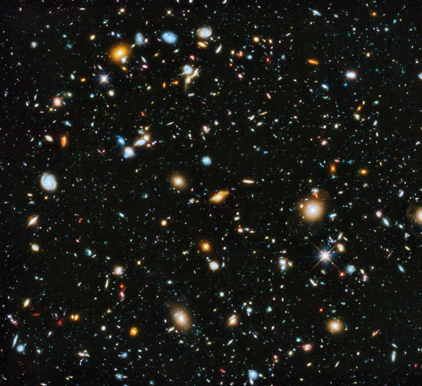

*Réponse publiée [sur Quora](https://fr.quora.com/Combien-y-a-t-il-de-galaxies-dans-tout-lunivers/answer/Dr-Goulu)*

L' "Univers actuellement connu" est l'[Univers observable](w:). On en connaîtra jamais plus. Plutôt moins à cause de l'accélération de l'expansion.

Et dans ce petit bout d'univers, il y a (environ…) 2000 milliards de galaxies[[1]](#tbEzF).

Ce chiffre est produit par extrapolation de comptage sur des images de [Champ profond de Hubble](w:) telles que celle-ci :

C'est une minuscule zone du ciel qui apparaît parfaitement noire à l'œil. Tous les points même les moins lumineux sont des galaxies.

Sauf une seule étoile de notre galaxie qui se trouve dans le champ, le point qui a des aigrettes de diffraction, cherchez Charlie…

Les catalogues de galaxies "connues", dont on a mesuré diverses caractéristiques, ne contiennent que quelques dizaines de millions d'objets.

Notes de bas de page

[[1]](#cite-tbEzF)[Hubble bouleverse la comptabilité des galaxies](https://www.sciencesetavenir.fr/espace/univers/dix-fois-plus-de-galaxies-dans-l-univers-observable_107518)
