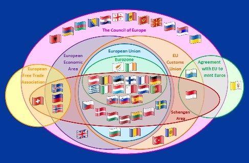

*Réponse publiée [sur Quora](https://fr.quora.com/Le-public-britannique-a-t-il-%C3%A9t%C3%A9-induit-en-erreur-en-votant-pour-le-Brexit/answer/Dr-Goulu)*

J'étais à Cambridge pour affaires peu avant le vote. Nos partenaires, tous de niveau universitaire, nous ont invité le soir dans un pub et la discussion est partie sur le Brexit, en "anglais de pub" que j'avais de la peine à suivre, mais j'ai quand même capté les noms de plein de politiciens anglais, et "new elections" plusieurs fois, mais rien sur l'Europe.

A un moment je les ai interrompus, un peu pour les calmer parce que ça s'envenimait, et dit que je ne les entendais pas parler d'Europe. Et là ils étaient tous d'accord et clairs : ce référendum concernait la politique intérieure du Royaume-Uni , pas l'UE !

Mon impression est que le Royaume-Uni n'a jamais fait partie de l'UE. En gardant leur monnaie, leur conduite à gauche, leur famille royale etc. ils considéraient l'UE comme un partenaire économique, rien de plus.

Un peu comme la Suisse…

Ce qui me surprend c'est qu'ils ne demandent pas à rejoindre l'AELE ou l'EEE

