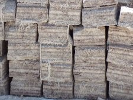
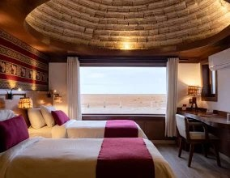

*Réponse publiée [sur Quora](https://fr.quora.com/Il-existe-un-h%C3%B4tel-construit-en-sel-en-Bolivie-comment-est-il-possible-de-construire-en-sel-Comment-%C3%A7a-fonctionne/answer/Dr-Goulu)*

J'y ai passé une nuit c'est touristique[[1]](#ekVKr) , mais assez sympa. En fait les cabanes des rares habitants autour sont aussi construites en briques de sel coupées à la scie dans le sel du fantastique [Salar d'Uyuni](w:).

Ce n'est pas très solide, ça va pour faire des murs d'un seul étage, à la rigueur une coupole façon igloo au dessus :

L'ennemi, c'est la pluie… en fait la coupole est recouverte de plastique sinon elle disparaîtrait assez vite.

Notes de bas de page

[[1]](#cite-ekVKr)[Primer hotel de sal del mundo | Hotel de Sal en Uyuni, Bolivia](https://palaciodesal.com.bo/fr/histoire/)
