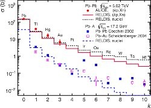

*Réponse publiée [sur Quora](https://fr.quora.com/Que-penser-des-physiciens-du-CERN-qui-ont-r%C3%A9ussi-%C3%A0-transformer-du-plomb-en-or-Malheureusement-pour-une-fraction-de-seconde-certes-mais-est-ce-une-avanc%C3%A9e-spectaculaire/answer/Dr-Goulu)*

C'est très difficile, voir [Comment transformer le plomb en or ? - Pourquoi Comment Combien](/2013/03/15/comment-transformer-le-plomb-en-or/)

Selon la page du CERN [ALICE détecte la transformation de plomb en or au LHC](https://www.home.cern/fr/news/news/physics/alice-detects-conversion-lead-gold-lhc), ce n'est pas vraiment volontaire, c'est plutôt qu'ils ont maintenant la capacité de détecter la formation de noyaux lors de collisions plomb+plomb.

Et ça produit plein d'isotopes principalement radioactifs, surtout du thalium, du mercure, un peu d'or, encore moins de platine etc. selon la distribution suivante illustrant leur article[[1]](#lOZbM) .

En passant, cet article ne se base pas sur "une fraction de seconde" mais sur un cumul d'expériences pendant 3 ans.

Non, ce n'est pas une "avancée spectaculaire" en physique, mais plutôt en technique de mesure. Une fois de plus…

Notes de bas de page

[[1]](#cite-lOZbM)[https://link.aps.org/doi/10.1103...](https://link.aps.org/doi/10.1103/PhysRevC.111.054906)
