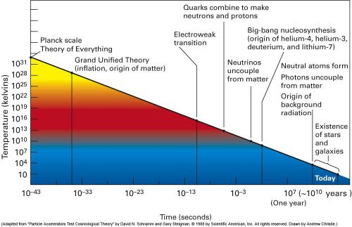

*Réponse publiée [sur Quora](https://fr.quora.com/Comment-la-singularit%C3%A9-primordiale-subatomique-a-t-elle-pu-%C3%A9voluer-vers-une-telle-complexit%C3%A9-cosmique-et-quelles-forces-fondamentales-ont-provoqu%C3%A9-son-expansion-initiale-lors-du-Big-Bang/answer/Dr-Goulu)*

On ne sait pas s'il y a eu une "singularité primordiale subatomique". Les singularités sont des objets mathématiques, pas physiques. Et surtout le [Big Bang](w:) n'est pas une explosion, c'est une dilatation de l'espace, ce qui conduit à une baisse de température remarquablement linéaire si on l'observe sur une échelle logarithmique :

Sur ce graphique vous constatez :

1. que la complexité résulte de [Transitions de phase](w:Transition_de_phase) elles-mêmes dues à des [Brisures de symétrie](w:Brisure_de_symétrie)bien distinctes et réparties le long d'une longue [Histoire de l'Univers](w:Histoire_et_chronologie_de_l'Univers) délimitant plusieurs "ères" pendant ce que le grand public appelle "le Big Bang"
2. Qu'il s'est passé beaucoup plus de choses (= interactions entre particules) pendant la première seconde du Big Bang que depuis
3. Que le "Big Bang" est toujours en cours, et va durer encore très Très TRES longtemps, avec encore plein de changements , voir [Chronologie du futur lointain — Wikipédia](w:Chronologie_du_futur_lointain)
4. Que le graphique s'arrête à gauche au [Temps de Planck](w:)parce que notre physique bute sur le "mur de Planck", mais ça ne veut ni dire qu'il n'y avait rien "avant", ni que ce moment et la "théorie du tout" associée ait existé !

En effet, beaucoup de théories cosmologiques actuelles sont basées sur l'idée d'une [Fluctuation quantique](w:)ayant donné naissance à un Univers temporaire, éventuellement cyclique.
