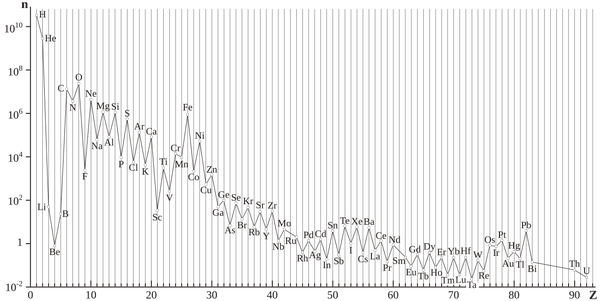

*Réponse publiée [sur Quora](https://fr.quora.com/Pourquoi-la-Terre-n-est-elle-pas-aussi-grande-que-les-autres-plan%C3%A8tes/answer/Dr-Goulu)*

Parce que l'[Échappement atmosphérique](w:)ne permet pas aux planètes intérieures de conserver d'énormes atmosphères comme les planètes gazeuses (Jupiter et Saturne) et de "glaces" (Uranus et Pluton)

Comme indiqué dans d'autres réponses, la Terre est la plus grosse des planètes telluriques, mais il est probable que le noyau rocheux de Jupiter [[1]](#EPCpz) et peut-être celui d'autres planètes géantes soit plus gros que la Terre.

D'une manière générale il y a peu de matériaux "solides" lors de la formation d'un système solaire. Si vous consultez l'[Abondance des éléments chimiques](w:)dans l'Univers représentée sur ce graphique :

Vous voyez qu'il y a environ 10'000 fois moins de Silicium, d'Aluminium ou de Fer que d'hydrogène, et 100x moins que de Carbone, d'Oxygène ou d'Azote, ce qui explique qu'un système "normal" contienne peu de cailloux par rapport aux gaz, éventuellement liquides, et aux glaces.

Et gardez en mémoire que l'atmosphère particulière de la Terre a été transformée par des êtres vivants. Quelques degrés de plus et la Terre aurait ressemblé à Vénus.

Notes de bas de page

[[1]](#cite-EPCpz)[Le coeur de Jupiter est rocheux et glacé...](https://www.futura-sciences.com/sciences/actualites/astronomie-coeur-jupiter-rocheux-glace-17504/)
