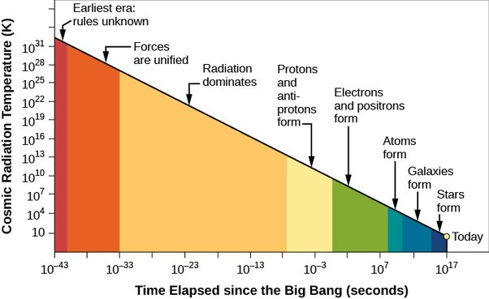

*Réponse publiée [sur Quora](https://fr.quora.com/Lespace-le-temps-la-mati%C3%A8re-et-l%C3%A9nergie-ont-ils-toujours-exist%C3%A9/answer/Dr-Goulu)*

Remarquez déjà un problème avec votre question : vous demandez si le temps a toujours existé, mais le mot "toujours" présuppose un temps infini (vers le passé, dans le contexte de la question). Le temps existe forcément depuis que le temps existe, et pas avant …

Nous ne définissons le temps que par sa mesure, parce que sa nature fondamentale n'est pas encore claire :

1. en relativité [le temps est une 4ème dimension imaginaire](/2007/02/07/le-temps-une-4eme-dimension-imaginaire/), au sens mathématique du terme, et l'espace-temps est un [Univers-bloc](w:)dans lequel le Big Bang est une singularité, un "sommet", et là non, on ne peut pas facilement imaginer un "avant"
2. en mécanique quantique, le temps (et/ou l'espace) sont des illusions produites par l'évolution du vecteur d"état de l'Univers entier, ou de sa "[Fonction d'onde](w:)" dans la direction de la [Flèche du temps](w:), l'augmentation de l'entropie.

Avant de revenir sur une tentative de conciliation, examinons la partie "matière et énergie" de votre question. D'abord, [l’énergie n’est pas une chose](https://reponsesfrequentes.quora.com/L-%C3%A9nergie-n-est-pas-une-chose) . Elle n'a jamais "existé". C'est juste une grandeur qui se conserve dans un système isolé. C'est un nombre qui se calcule à partir des masses, vitesses et autres caractéristiques des particules enfermées dans le système, et on constate que ce nombre ne varie pas lors de toutes les transformations et interactions possibles de ces particules. Il n'y a pas d'énergie sans matière, et encore moins d' "énergie pure".

Pour la matière, c'est plus compliqué car elle existe sous plein de formes différentes. Les atomes lourds ont été formés dans des étoiles "récentes", disons il y a 7 ou 8 milliards d'années. Les atomes (essentiellement d'hydrogène) se sont formés lors de la [Recombinaison](w:Recombinaison_(cosmologie)), 380'000 ans après le Big Bang. Les protons se sont formés pendant l'[Ère des quarks](w:)qui a eu lieu dans le premier millième de seconde du Big Bang et on pense qu'avant ça il y avait surtout, voire quasi uniquement des photons, et avant ça mystère et boule de gomme.

Si on représente le mystérieux temps sur une échelle logarithmique, on constate que la composition de la matière varie, souvent abruptement lors de la longue [Histoire et chronologie de l'Univers](w:):

Dans ce contexte oui, la matière a "toujours" existé parce qu'il n'y a pas de temps sans particules qui peuvent bouger, et vice.versa. Mais en passant, en représentant le temps sur une échelle logarithmique comme ci-dessus, ou en le remplaçant par (l'inverse de) la température, il n'y a plus de "singularité" au Big Bang : l'Univers devient quasi éternel par un tour de passe-passe mathématique. Il ne reste plus qu'un énorme problème de cohérence de la physique au "Mur de Planck" à $10^{-43}$ seconde…

En réfléchissant à tout ça et à ce qui précède sur le temps et l'espace, beaucoup de théoriciens suivent la piste de la [Fluctuation quantique](w:) : si on écrit la [Fonction d'onde](w:)d'un Univers vide, sans aucune particule, ben il y a quand même une probabilité faible, mais non nulle qu'il produise un univers entier (je n'ai pas le niveau pour détailler ceci, encore moins pour éliminer le temps de l'équation…)

Le plus intéressant, c'est que ceci n'est possible que pour un [Univers à énergie nulle](w:), dans lequel l'énergie "positive" de votre question est contrebalancée par l'énergie potentielle gravitationnelle qui est "négative" puisqu'il faut fournir de l'énergie pour sortir une masse d'un champ gravitationnel.

Donc la réponse actuelle à votre question, c'est que ce qui existerait "depuis toujours", c'est le vide quantique. Et que la somme de tout ce qui existe depuis le Big Bang est nulle. Zéro. Nada.

La matière et l'espace (indissociable de la gravitation) sont les deux faces, complémentaires et opposées, de cette fluctuation quantique.

Le temps, je ne sais toujours pas. Mais j'ai beaucoup aimé [La Renaissance du Temps](/2015/01/28/la-renaissance-du-temps/), un livre (corsé…) de Lee Smolin, qui défend l'idée que le temps existe vraiment, et qu'il est éternel.

Ca ouvre la porte à des hypothèses d' univers cycliques comme la [Cosmologie cyclique conforme](w:)de Sir Roger Penrose, selon lesquels un nouveau Big Bang peut se produire quand toutes les particules de l'Univers précédent seront désintégrées, et leurs photons dilués dans un Univers totalement froid.
