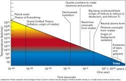

*Réponse publiée [sur Quora](https://fr.quora.com/Si-l-instant-t-0-correspond-%C3%A0-l-apparition-du-temps-et-de-l-espace-alors-l-univers-a-surgi-du-n%C3%A9ant/answer/Dr-Goulu)*

C'est quoi l'instant t=0 ?

Comment mesurez-vous le temps dans un plasma quark-gluon ?

Si vous mesurez le "temps" par des grandeurs physiques pendant ces [ères](w:Histoire_et_chronologie_de_l'Univers), il n'y a pas de t=0.

