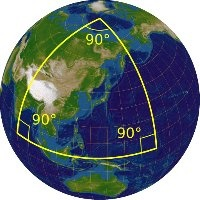

*Réponse publiée [sur Quora](https://fr.quora.com/La-rotondit%C3%A9-de-la-Terre-et-des-autres-plan%C3%A8tes-d%C3%A9pend-elle-du-r%C3%A9f%C3%A9rentiel/answer/Dr-Goulu)*

Non. La courbure est une valeur locale. Il suffit de tracer un (grand) triangle et de mesurer la somme des angles. Sur un plan on obtient 180°. Sur une sphère on obtient plus :

Ça m'en rappelle une marrante :

> Un explorateur quitte son campement et marche 20 km plein sud, puis il tourne à angle droit et marche 20 km tout droit en direction de l’est. Puis il tourne à nouveau à angle droit et marche 20 km parfaitement vers le nord. Il arrive en plein sur son campement, où il découvre un ours en train de dévorer ses provisions.
> [De quelle couleur est l’ours ?](https://drgoulu.com/2013/10/08/de-quelle-couleur-est-lours/)
