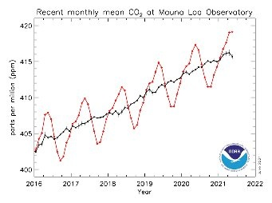

*Réponse publiée [sur Quora](https://fr.quora.com/Que-pensez-vous-de-ce-chiffre-l-humain-a-un-taux-d%C3%A9mission-en-CO2-de-3-Pouvez-vous-confirmer-ou-infirmer-par-des-sources/answer/Dr-Goulu)*

C'est quoi un "taux d'émission en CO2"?

3% de quoi ?

Les mesures de la concentration de CO2 dans l'atmosphère montrent une croissance ininterrompue de l'ordre de 10 ppm chaque 4 ans actuellement (courbe noire)

(L'explication de l'oscillation saisonnière (courbe rouge) est très intéressante. Essayez de deviner sa cause avant de lire la source : [Le taux de CO2 dans l’atmosphère au plus haut depuis 4 millions d’années](https://youmatter.world/fr/categorie-environnement/taux-co2-atmosphere-plus-haut-changement-climatique/))

Donc là, l'augmentation est de 10/400/4 = 0.625% par année, et elle est du uniquement à nos émissions.

Pendant des milliers d'années, la concentration de CO2 était de 280 ppm et elle a augmenté dès le début de l'ère industrielle à 420 ppm actuellement.

Ça fait pile une augmentation de 50%, due uniquement à nos émissions.

Cette augmentation cause un "forçage radiatif" correspondant exactement à la hausse des températures moyennes sur Terre.

Elle est due à 100% à nos émissions.

Sources : tous les articles scientifiques cités dans les rapports du GIEC depuis 1988, date de sa fondation par Reagan et Thatcher, deux écologistes notoires qui ne croyaient déjà pas aux prévisions de l'office météorologique mondial.

Ya pas de 3%.

[https://drgoulu.com/2007/05/23/f...](/2007/05/23/faq-rechauffement-global/)
