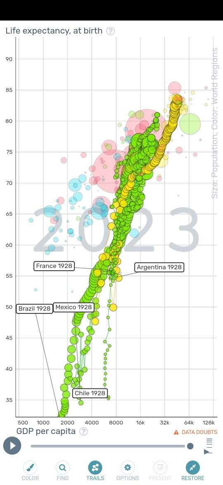

*Réponse publiée [sur Quora](https://fr.quora.com/Quand-lAm%C3%A9rique-latine-sera-t-elle-d%C3%A9velopp%C3%A9e/answer/Dr-Goulu)*

La France était développée en 1990 ?

Les grands pays d'Amérique Latine sont à ce niveau maintenant.

Yers 1930 l'Argentine était au niveau de la France d'alors.

[Gapminder Tools](https://www.gapminder.org/tools/#$model$markers$bubble$data$filter$dimensions$geo$/$or@$un_state:true;&$geo$/$in@=un_latin_america_and_the_caribbean;;;;;;;;&encoding$y$scale$zoomed@:50.85&:100;;;&x$scale$zoomed@:546.73&:30480.56;;;&frame$speed:1156&value=1974;&trail$data$filter$markers$fra=1928&bra=1928&arg=1928&chl=1928&mex=1928;;;;;;;;&chart-type=bubbles&url=v2)
