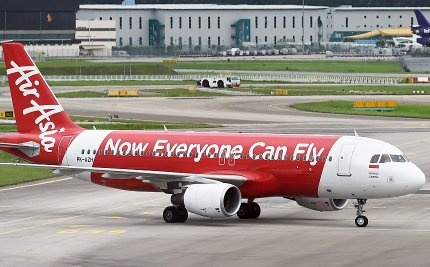

*Réponse publiée [sur Quora](https://fr.quora.com/Que-pensez-vous-de-la-d%C3%A9marche-%C3%A9coresponsable-dans-un-monde-r%C3%A9git-par-la-consommation-excessive-Pensez-vous-quil-possible-dinfluencer-positivement-les-gens-%C3%A0-devenir-%C3%A9coresponsable/answer/Dr-Goulu)*

Quels gens ? Les bobos des villes européennes peut-être…

Ici en Asie, un milliard de gens peuvent désormais se payer des voyages en avion. Lisez bien le slogan d'[AirAsia](w:en:AirAsia):

Mon chauffeur de taxi thaïlandais a pris l'avion pour la première fois de sa vie pour aller au Japon voir les cerisiers en fleurs avec sa femme.

On lui dit quoi à lui pour qu'il soit "écoresponsable" ? Reste dans ta misère ? Trime pour te payer plutôt un taxi électrique ?

La "consommation excessive" c'est un fantasme de riche. Peut-être 1% de la population mondiale. Dans votre pays je suis sur que la plupart des gens aimeraient bien pouvoir consommer juste un peu plus à la fin du mois.

Le monde est encore régi (sans T) majoritairement par l'angoisse du lendemain ou du surlendemain. En Europe si vous perdez votre job, vous tiendrez peut-être un an ou deux sur les aides sociales. Ailleurs, il n'y en a pas. En quelques semaines vous êtes à la rue.

L'écoresponsabilité est le dernier des soucis de 90% des humains. Vous n'avez qu'à observer la chute des partis écologistes (partout) dès les premières turbulences économique. Il faudra faire avec.
