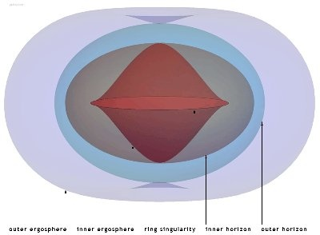

*Réponse publiée [sur Quora](https://fr.quora.com/Pourquoi-les-trous-noirs-ont-t-ils-une-forme-sph%C3%A9rique-avec-leur-disque-d-accr%C3%A9tion-etc/answer/Dr-Goulu)*

Les trous noirs ne sont pas sphériques. C'est éventuellement leur [Horizon des événements](w:)qui le serait s'ils ne tournaient pas. Dans ce cas tout se passe comme si la masse du trou était concentrée en un seul point, la fameuse "singularité".

Sur l'horizon il ne se passe rien de spécial. C'est juste une frontière théorique : aucun photon, a fortiori une autre particule, ne peut traverser cette surface vers l'extérieur. Tout entrée est définitive…

Mais les [vrais trous noirs](w:Trou_noir_de_Kerr) tournent très vite[[1]](#IhNxk) . Leurs horizons (ils en ont plusieurs) sont elliptiques, et leur singularité, si elle existe, est un anneau.

Le [Disque d'accrétion](w:)n'est pas spécifique au trou noir. C'est simplement de la matière en orbite autour d'un astre massif.

Dans le cas d'un trou noir ou d'une étoile à neutrons, la vitesse orbitale est telle que les chocs entre particules chauffent la matière au point qu'elle émet dans les ondes radio ou les infrarouges, parfois dans le visible.

Contrairement à ce qu'on pense souvent, très peu de matière est absorbée par un trou noir. Une bonne partie est rejetée par les [Jets](w:Jet_(astrophysique)) qui se forment le long de l:axe de rotation du trou.

Notes de bas de page

[[1]](#cite-IhNxk)[A combien tourne un trou noir ? - Pourquoi Comment Combien](https://drgoulu.com/2016/07/10/combien-tourne-un-trou-noir/)
