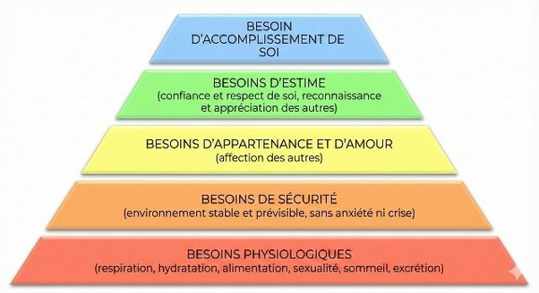

*Réponse publiée [sur Quora](https://fr.quora.com/Peut-on-cr%C3%A9er-le-besoin/answer/Dr-Goulu)*

Non. C'est un mythe auquel je croyais aussi avant de prendre des cours d'économie.

Nos besoins sont tous dans la [Pyramide des besoins](w:)(dite de Maslow)

Tous les "besoins créés" sont en réalité des moyens de satisfaire ces besoins là.

Pendant des millénaires, la demande de satisfaire ces besoins a excédé l'offre : on avait pas les moyens d'assurer une santé de base, ni l'alimentation, ni de l'eau propre, encore moins de moyens de transport ou de communication. L'estime ou l'accomplissement de soi étaient réservés à une élite minuscule.

Ce qui a changé, ce n'est pas qu'on a "créé des besoins", c'est que l'on peut enfin proposer à une partie significative de l'humanité (et à un nombre d'humains inimaginable il y a encore quelques siècles) de satisfaire décemment deux ou trois niveaux de la pyramide.
