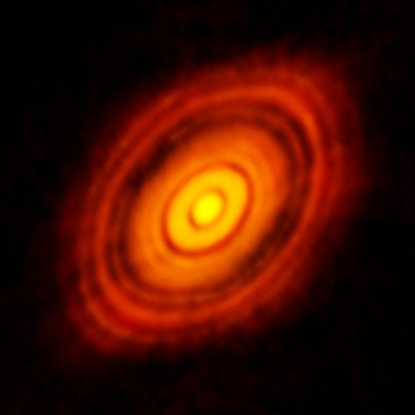

*Réponse publiée [sur Quora](https://fr.quora.com/Ganym%C3%A8de-est-elle-une-plan%C3%A8te-captur%C3%A9e-par-Jupiter-lors-des-premiers-%C3%A2ges-du-syst%C3%A8me-solaire-ou-bien-a-t-elle-toujours-%C3%A9t%C3%A9-une-lune/answer/Dr-Goulu)*

"planète capturée par Jupiter lors des premiers âges du système solaire" et "lune" (ou plutôt "satellite naturel" ) sont équivalents.

L'observation de [Disques protoplanétaires](w:Disque_protoplanétaire)montre que tout ça se forme en même temps et "rapidement" (quelques millions d'années). L'image la plus spectaculaire que je connaisse est celle de [HL Tauri](w:):

On y voit que toute la matière tourne "bien rond" autour de l'étoile. Les bandes sombres correspondent à des orbites proches des [Planétésimaux](w:Planétésimal), ces grumeaux que l'on distingue dans ces orbites et qui "nettoient" les orbites proches en se formant.

Les planétésimaux vont s'agglomérer pour former des planètes et leurs lunes, mais ne peuvent pas "capturer" des corps orbitant sur des orbites trop différentes.
