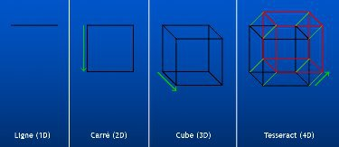

*Réponse publiée [sur Quora](https://fr.quora.com/Comment-pourriez-vous-me-faire-comprendre-la-4%C3%A8me-dimension-Car-honn%C3%AAtement-je-n-arrive-pas-%C3%A0-saisir-%C3%A0-quoi-elle-peut-ressembler/answer/Dr-Goulu)*

C'est tout simple :

[Voir en 4 dimensions - Pourquoi Comment Combien](https://drgoulu.com/2007/02/06/voir-en-4-dimensions/)

Maintenant si vous pensez au temps comme 4ème dimension, c'est un peu plus compliqué car [Le temps est une dimension imaginaire](https://drgoulu.com/2007/02/07/le-temps-une-4eme-dimension-imaginaire/)au sens mathématique du terme.
