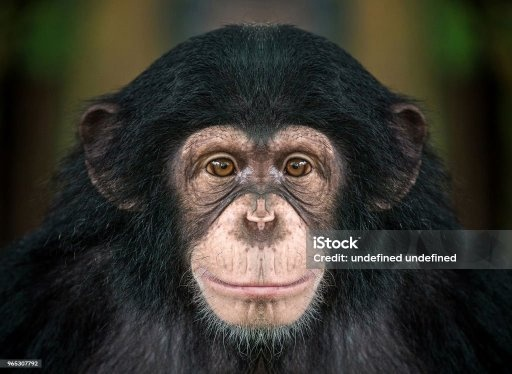

*Réponse publiée [sur Quora](https://fr.quora.com/Le-chimpanz%C3%A9-est-noir-lui-do%C3%B9-vient-lAth%C3%A9e-blanc/answer/Dr-Goulu)*

Non, il n'y a que les poils des chimpanzés qui sont noirs. Leur peau est claire.

Comme nous n'avons plus de poils épais partout, la [Couleur de la peau humaine](w:)change très "vite" en fonction du lieu où on vit, précisément en raison de mécanismes évolutifs :

> **Avantage sélectif d'une peau foncée**
>
>
>
> La [pression de sélection](w:) la plus généralement retenue pour expliquer la pigmentation de la peau des premiers hominiens est l'effet délétère des UV-A, qui dégradent les [folates](w:Folate) (par [photolyse](w:)) et induisent une [carence en vitamine B9](w:Vitamine_B9)[[6]](w:Couleur_de_la_peau_humaine). Cette vitamine est cruciale chez la femme enceinte pour le bon développement embryonnaire. D'autres hypothèses sont aussi avancées, notamment les risques de brûlure et de cancers cutanés encourus par les peaux claires[[7]](w:Couleur_de_la_peau_humaine).
>
>
>
> **Avantage sélectif d'une peau claire**
>
>
>
> À l'inverse, l'hypothèse retenue pour expliquer la plus faible pigmentation de la peau sous de hautes latitudes est qu'une peau trop sombre augmente le risque de souffrir de [rachitisme](w:) par manque de [vitamine D](w:), celle-ci n'étant synthétisée que si une quantité suffisante d’UV pénètre jusqu’au [derme](w:)[[8]](w:Couleur_de_la_peau_humaine). De fait, avant l’apparition des suppléments vitaminés, le rachitisme était particulièrement fréquent en hiver dans les zones tempérées, même chez les Européens à peau claire. Les [Inuits](w:Inuit) au teint cuivré tirent leur vitamine D d'une alimentation particulière riche en graisse d'animaux marins.
>
>
>
> ([Couleur de la peau humaine — Wikipédia](w:Couleur_de_la_peau_humaine))

Mais c'est probablement trop compliqué pour toi Hatem. Commence par aller à l'école en plus du zoo.
