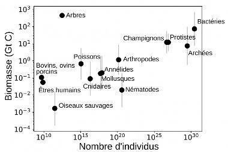

*Réponse publiée [sur Quora](https://fr.quora.com/Pourquoi-la-Vie-a-commenc%C3%A9-sous-des-formes-tr%C3%A8s-simples-et-na-cess%C3%A9-de-se-complexifier-depuis/answer/Dr-Goulu)*

D'abord il n'y a pas de majuscule à "vie".

Ensuite, selon [[1]](#mwNIV) , il y a plus de bactéries sur Terre que toutes les autres êtres vivants réunis, en deux les archées, en trois les protistes.

Donc les formes de vie très simples (unicellulaires) représentent plus de 99.9% des êtres vivants.

Les êtres complexes (multicellulaires) sont donc très rares, et il n'y a que les plantes qui rivalisent en masse totale avec les bactéries.

Les animaux ne sont qu'une infime minorité, et ils ne sont apparus que "récemment", principalement depuis l"[Explosion cambrienne](w:)il y a 540 millions d'années "seulement".

La complexité est un truc que l'évolution a trouvé. Ça fonctionne, donc ça survit. Nous y accordons une grande valeur parce que nous faisons partie des êtres complexes.

Mais la vie et l'évolution s'en fichent. Elles n'ont ni but ni direction .

Ce qui fonctionne se reproduit, c'est tout.

Notes de bas de page

[[1]](#cite-mwNIV)[La répartition de la biomasse sur Terre](https://planet-vie.ens.fr/thematiques/ecologie/relations-trophiques/la-repartition-de-la-biomasse-sur-terre)
