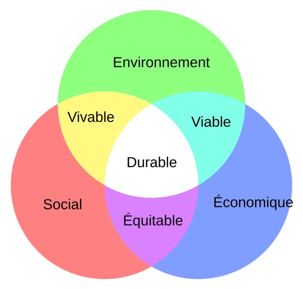

*Réponse publiée [sur Quora](https://fr.quora.com/Un-syst%C3%A8me-durable-est-un-syst%C3%A8me-capable-de-transformer-son-exp%C3%A9rience-en-connaissance-sans-compromettre-durablement-son-int%C3%A9grit%C3%A9-ni-celle-des-milieux-dont-il-d%C3%A9pend/answer/Dr-Goulu)*

Ça sort d'où cette définition ? Quand une définition utilise son propre mot dans la définition, elle se mord la queue…

Le [Développement durable](w:)se définit par l'intersection de trois contraintes :

A mon sens, la population est le facteur oublié, et il correspond à écarter ou à rapetisser les cercles.

Je ne sais pas s'ils ont toujours une intersection…

[Développement Durable et Equation de Kaya - Pourquoi Comment Combien](https://share.google/QPLcVxGmYqQWKgbev)
